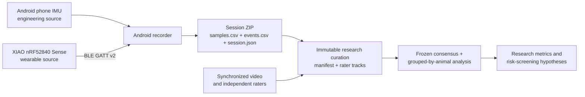

# Goat Sensor Lab

Research tooling for measuring behavior in **indoor, stall-fed goats and sheep** with an
Android phone today and a Seeed Studio XIAO nRF52840 Sense wearable next.

The project records timestamped accelerometer observations paired with the nearest preceding
gyroscope reading inside a rate-scaled tolerance (or an explicit missing value),
plus simultaneous live observer heads for ingestive behavior, posture/activity, and welfare
observations. It is designed to create the
species- and farm-specific evidence needed before any production alert is trusted.

> This is a research data-collection system. It does not diagnose disease, confirm pregnancy,
> or replace veterinary examination.

## What works now

- Android recorder using the phone's accelerometer and gyroscope.
- Requested rates of 5, 10, 16, 25, or 50 Hz; achieved rate is measured in session metadata.
- Separate simultaneous live label heads for feeding/rumination, posture/activity, and welfare observation.
- Event-time label assignment, monotonic timestamps, durable CSV/JSON storage, valid-prefix crash
  recovery with corrupt-original quarantine, and integrity-gated ZIP export.
- XIAO nRF52840 Sense firmware and Android BLE adapter with a verified capability/status handshake
  sharing the same data contract.
- Leakage-resistant Python baselines with domain guards, grouped uncertainty/calibration metrics,
  reproducibility manifests, and an evidence-linked experiment wiki.

Live app labels are field-observer state, not independent or adjudicated research ground truth.
The repository defines append-only multi-rater annotations, reproducible consensus, clinical
outcomes, and experiment-manifest contracts for post-export curation; the Android app does not yet
generate those governance artifacts automatically.

An earlier pre-publication Android build was exercised on an Infinix phone at a measured **25.9
Hz**, and its ZIP share flow was verified. That capture used the former 24-column draft schema.
The current 25-column release build and UI have been installed and visually checked on an Android
emulator because the phone was unavailable for the release pass. XIAO firmware compiles, but the
current release has not been flashed or radio-tested on an actual board.

## System



Phone and board samples become the same `SensorFrame`; algorithms do not depend on where a row
came from. Models intended for animals must still be trained and validated using the final board,
mount, enclosure, species, and shed conditions.

## Android quick start

Requirements: JDK 21 and Android SDK 36.

```bash
./gradlew testDebugUnitTest assembleDebug
adb -s <PHONE_SERIAL> install -r app/build/outputs/apk/debug/app-debug.apk
```

1. Select **Phone IMU** for engineering tests or **XIAO Sense (BLE)** after flashing the board.
2. For XIAO, copy the immutable `GoatSensor-<16 hex>` ID printed over USB serial at boot into
   the app. The recorder connects only to that exact board.
3. Enter the animal ID, species, placement, rate, annotator, shed/pen, camera IDs, and notes.
4. Start recording, change each label head only when the observed behavior changes, then stop.
5. Export the ZIP from the app.

The first Android version deliberately keeps the screen awake and records only while the app is
open. Leaving the foreground finalizes the session. On the next launch, interrupted CSVs are
validated and atomically repaired to their last complete canonical record, damaged originals are
quarantined, and any session that cannot be proven consistent is blocked from export. It does not
use the camera, microphone, GPS, contacts, or automatic network upload.

## XIAO quick start

The board must be the **XIAO nRF52840 Sense**, not the non-Sense version.

```bash
cd firmware/xiao-nrf52840-sense
pio run
pio run --target upload
```

No soldering is required for the USB-C desk test. A battery-powered wearable later needs battery
leads soldered to the board pads or a compatible expansion adapter. The onboard IMU needs no
soldering. See [the hardware guide](wiki/hardware/xiao-nrf52840-sense.md) and
[BLE protocol](protocol/ble-v2.md).

## Analysis quick start

```bash
cd analysis
uv sync --extra dev --frozen
uv run pytest
uv run goat-sensor-analysis validate /path/to/samples.csv
uv run goat-sensor-analysis train /path/to/samples.csv \
  --experiment-manifest /path/to/experiment-manifest-v1.json \
  --annotations /path/to/annotations-v1.csv \
  --consensus /path/to/annotation-consensus-v1.json \
  --output reports/baseline
```

Research training verifies exact sample/annotation digests and replaces live app labels with the
frozen consensus intervals. For recorder-only diagnostics, pass `--engineering-live-labels`; that
mode writes windows and a warning summary but cannot produce models or research artifacts.
Evaluation splits are made by animal or session. Randomly splitting overlapping sensor rows is not
accepted because it produces misleadingly high accuracy.

## Documentation

Start at the [wiki index](wiki/README.md). Key references:

- [Architecture](wiki/architecture/system.md)
- [Canonical data contract](wiki/data/data-contract.md)
- [Canonical schemas](schema/README.md)
- [Ethogram](wiki/experiments/ethogram.md)
- [Pilot protocol](wiki/experiments/pilot-protocol.md)
- [Evidence matrix](wiki/research/evidence-matrix.md)
- [Literature search method](wiki/research/literature-search-method.md)
- [Open-source reference index](references/README.md)
- [Welfare and claim boundaries](wiki/welfare/ethics-and-claims.md)
- [Validation roadmap](wiki/roadmap/validation-roadmap.md)
- [Release verification boundary](wiki/verification/release-verification.md)

## Scope

Included: indoor feeding, rumination, lying, standing, movement, individual baseline deviations,
estrus/parturition research labels, and early welfare-risk signals.

Excluded: GPS grazing, virtual fencing, aversive actuation, or claiming a wearable alone proves a
medical/reproductive state.

## License

Code is licensed under the [MIT License](LICENSE). Papers, datasets, vendor documents, and referenced
repositories retain their original copyrights and licenses.
