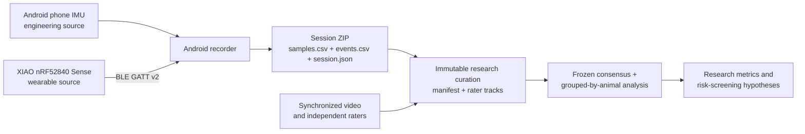

# Goat Sensor Lab

Research tooling for measuring behavior in **indoor, stall-fed goats and sheep** with an
Android phone today and a Seeed Studio XIAO nRF52840 Sense wearable next.

The project records timestamped accelerometer observations paired with the nearest preceding
gyroscope reading inside a rate-scaled tolerance (or an explicit missing value),
plus simultaneous live observer heads for ingestive behavior, posture/activity, and welfare
observations. It is designed to create the
species- and farm-specific evidence needed before any production alert is trusted.

> This is a research data-collection system. It does not diagnose disease, confirm pregnancy,
> or replace veterinary examination.

## Project overview

Goat Sensor Lab **builds the laboratory and measuring instrument, not the final scientific
result**.

It is similar to making a research Fitbit for goats and sheep. A movement sensor records how an
animal moves, an observer or synchronized video supplies trustworthy behavior labels, and the
analysis tools look for movement patterns associated with those labels. The project provides the
recorder, data format, small-sensor Bluetooth path, quality checks, experiment instructions, and
model-training machinery needed to do that carefully.

It does **not** currently contain a model that can reliably look at an arbitrary goat and announce
what it is doing or whether it is unwell. Creating that model requires a properly approved study,
real recordings from many animals, synchronized video, independent observers, and validation on
animals and farms that were not used during training.

### What happens in a study

1. A researcher identifies the animal, sensor placement, shed or pen, observer, cameras, and
   sampling rate in the Android app.
2. The phone IMU can be used for desk and engineering tests. The intended wearable uses a XIAO
   nRF52840 Sense board on a safe collar or harness.
3. The app records acceleration, rotation, timestamps, packet sequence, sensor identity, and
   session configuration.
4. During live observation, the researcher can independently mark feeding/rumination,
   posture/activity, and a conservative welfare observation. These live buttons are field notes,
   not automatically accepted scientific truth.
5. The app stops and exports a ZIP containing `samples.csv`, `events.csv`, and `session.json`.
   Interrupted or internally inconsistent sessions are repaired only to a proven valid prefix,
   quarantined, or blocked from export.
6. For research use, synchronized video is labelled independently by multiple observers. Their
   agreement, disagreements, revisions, exclusions, and adjudication are recorded in immutable
   annotation and consensus files.
7. The analysis package verifies the exact files and their hashes, joins the approved labels to
   the correct sensor times, removes unreliable intervals, and converts short motion windows into
   numerical features.
8. Baseline models are evaluated by holding out entire animals or sessions. This checks whether a
   model generalizes beyond the individual recordings it learned from instead of rewarding it for
   memorizing nearly identical sensor rows.

### What model does this project train?

The baseline is a **Random Forest**: a committee of decision trees. Each tree evaluates rules over
the movement window—for example, how strong, variable, or jerky the acceleration and rotation
were—and votes on a label. The combined vote is the model's prediction.

The training code supports three separate research heads:

- **Ingestive behavior:** feeding, rumination, or neither.
- **Posture and activity:** lying, standing, or active movement.
- **Welfare-risk screening:** normal versus a possible abnormal-inactivity observation that needs
  human review.

The repository deliberately ships **no pretrained animal model**. Synthetic data is used to test
the software, not to claim animal accuracy. The welfare output is never a diagnosis, and models
remain marked as not eligible for deployment until external animal- and site-level validation is
completed.

### What is finished, and what is not?

| Part | Current status |
|---|---|
| Android movement recorder and export | Built, automatically tested, and installed/visually checked on an Android emulator. |
| Current 25-column session contract | Built and validated, including timestamps, identities, labels, quality flags, and recovery rules. |
| Crash and corrupt-data protection | Built and tested; unsafe sessions are repaired conservatively, quarantined, or refused for export. |
| XIAO wearable path | Shared contract, BLE v2 protocol, Android adapter, and firmware are implemented; physical XIAO Sense board flashing, IMU detection, BLE capabilities, BLE streaming, and Android recording were verified on 2026-08-05. |
| Analysis and model tooling | Built and tested with synthetic fixtures, strict provenance checks, grouped evaluation, and reproducibility records. |
| Experiment, annotation, welfare, and hardware guidance | Documented in the project wiki and backed by a structured evidence/reference index. |
| Real goat/sheep behavior model | **Not yet available**; real multi-animal, video-labelled data must be collected first. |
| Production collar | **Not yet completed**; battery, enclosure, mounting, calibration, wearability, and animal safety still need physical testing. |
| Production or veterinary use | **Not approved**; prospective field validation and human/veterinary operating gates are still required. |

An older pre-publication build recorded and shared a session from a physical Infinix phone, but it
used the former 24-column draft. The exact current release was verified on an emulator because that
phone was unavailable. This boundary is intentional and is recorded in the
[release verification report](wiki/verification/release-verification.md).

## What works now

- Android recorder using the phone's accelerometer and gyroscope.
- Requested rates of 5, 10, 16, 25, or 50 Hz; achieved rate is measured in session metadata.
- Separate simultaneous live label heads for feeding/rumination, posture/activity, and welfare observation.
- Event-time label assignment, monotonic timestamps, durable CSV/JSON storage, valid-prefix crash
  recovery with corrupt-original quarantine, and integrity-gated ZIP export.
- XIAO nRF52840 Sense firmware and Android BLE adapter with a capability/status handshake sharing
  the same data contract. On 2026-08-05, a physical board was flashed, its onboard IMU was read,
  BLE capabilities reported `LSM6DS3TR-C`, BLE packets streamed, and the Infinix app saved a
  147-sample XIAO session at 26 Hz.
- Leakage-resistant Python baselines with domain guards, grouped uncertainty/calibration metrics,
  reproducibility manifests, and an evidence-linked experiment wiki.

Live app labels are field-observer state, not independent or adjudicated research ground truth.
The repository defines append-only multi-rater annotations, reproducible consensus, clinical
outcomes, and experiment-manifest contracts for post-export curation; the Android app does not yet
generate those governance artifacts automatically.

An earlier pre-publication Android build was exercised on an Infinix phone at a measured **25.9
Hz**, and its ZIP share flow was verified. That capture used the former 24-column draft schema.
The current 25-column release build and UI were installed and visually checked on an Android
emulator for the original release pass. On 2026-08-05, the XIAO path was physically verified with
the current app and firmware on an Infinix phone and Seeed Studio XIAO nRF52840 Sense board.

## System



Phone and board samples become the same `SensorFrame`; algorithms do not depend on where a row
came from. Models intended for animals must still be trained and validated using the final board,
mount, enclosure, species, and shed conditions.

## Android quick start

Requirements: JDK 21 and Android SDK 36.

```bash
./gradlew testDebugUnitTest assembleDebug
adb -s <PHONE_SERIAL> install -r app/build/outputs/apk/debug/app-debug.apk
```

1. Select **Phone IMU** for engineering tests or **XIAO Sense (BLE)** after flashing the board.
2. For XIAO, copy the immutable `GoatSensor-<16 hex>` ID printed over USB serial at boot into
   the app. The recorder connects only to that exact board.
3. Enter the animal ID, species, placement, rate, annotator, shed/pen, camera IDs, and notes.
4. Start recording, change each label head only when the observed behavior changes, then stop.
5. Export the ZIP from the app.

The first Android version deliberately keeps the screen awake and records only while the app is
open. Leaving the foreground finalizes the session. On the next launch, interrupted CSVs are
validated and atomically repaired to their last complete canonical record, damaged originals are
quarantined, and any session that cannot be proven consistent is blocked from export. It does not
use the camera, microphone, GPS, contacts, or automatic network upload.

## XIAO quick start

The board must be the **XIAO nRF52840 Sense**, not the non-Sense version.

```bash
cd firmware/xiao-nrf52840-sense
pio run
pio run --target upload
```

No soldering is required for the USB-C desk test or onboard IMU. The firmware environment must use
the Sense PlatformIO target `seeed-xiao-afruitnrf52-nrf52840-sense`; the plain
`seeed-xiao-afruitnrf52-nrf52840` target can build and flash but leaves the Sense IMU unavailable.
A battery-powered wearable later needs battery leads soldered to the board pads or a compatible
expansion adapter. See [the hardware guide](wiki/hardware/xiao-nrf52840-sense.md) and
[BLE protocol](protocol/ble-v2.md).

## Analysis quick start

```bash
cd analysis
uv sync --extra dev --frozen
uv run pytest
uv run goat-sensor-analysis validate /path/to/samples.csv
uv run goat-sensor-analysis train /path/to/samples.csv \
  --experiment-manifest /path/to/experiment-manifest-v1.json \
  --annotations /path/to/annotations-v1.csv \
  --consensus /path/to/annotation-consensus-v1.json \
  --output reports/baseline
```

Research training verifies exact sample/annotation digests and replaces live app labels with the
frozen consensus intervals. For recorder-only diagnostics, pass `--engineering-live-labels`; that
mode writes windows and a warning summary but cannot produce models or research artifacts.
Evaluation splits are made by animal or session. Randomly splitting overlapping sensor rows is not
accepted because it produces misleadingly high accuracy.

## Documentation

Start at the [wiki index](wiki/README.md). Key references:

- [Architecture](wiki/architecture/system.md)
- [Canonical data contract](wiki/data/data-contract.md)
- [Canonical schemas](schema/README.md)
- [Ethogram](wiki/experiments/ethogram.md)
- [Pilot protocol](wiki/experiments/pilot-protocol.md)
- [Annotation tooling and responsibility boundary](wiki/experiments/annotation-tooling.md)
- [Evidence matrix](wiki/research/evidence-matrix.md)
- [Literature search method](wiki/research/literature-search-method.md)
- [Open-source reference index](references/README.md)
- [Welfare and claim boundaries](wiki/welfare/ethics-and-claims.md)
- [Validation roadmap](wiki/roadmap/validation-roadmap.md)
- [Release verification boundary](wiki/verification/release-verification.md)

## Scope

Included: indoor feeding, rumination, lying, standing, movement, individual baseline deviations,
estrus/parturition research labels, and early welfare-risk signals.

Excluded: fixed-camera identity and tracking (owned by
[Herdlink](https://github.com/vgoats/herdlink)), GPS grazing, virtual fencing, aversive actuation,
or claiming a wearable alone proves a medical/reproductive state.

## License

Code is licensed under the [MIT License](LICENSE). Papers, datasets, vendor documents, and referenced
repositories retain their original copyrights and licenses.
