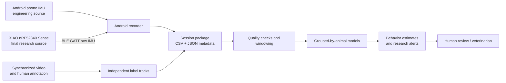

# System Architecture

## Scope

The system measures motion from goats and sheep kept inside sheds and links it to synchronized observation labels. Its purpose is to create evidence for behavior classification and individual-baseline alerts, not to provide virtual fencing or an autonomous veterinary diagnosis.

## Components

| Component | Role | Boundary |
|---|---|---|
| Android phone IMU | Proves sampling, monotonic timestamps, label controls, and export before the board arrives | Engineering-only; do not use phone sessions to claim goat/sheep accuracy |
| XIAO nRF52840 Sense | Captures raw 3-axis acceleration and 3-axis angular velocity at the actual ear/neck mount | Final research source; requires firmware, battery, enclosure, and BLE integration |
| Android recorder | Selects the source, stores canonical frames, records label-change events, and exports a session | Supervised research tool, not yet a production background service |
| Video and annotators | Establish time-aligned ground truth | Labels require a written ethogram and agreement checks |
| Herdlink | Owns fixed-camera pose, tracks, RFID-backed permanent identity, and identity-qualified shed events | Separate repository; Goat Sensor Lab must not create a competing camera-identity implementation |
| Analysis pipeline | Validates schema, segments windows, extracts features or trains sequence models, and evaluates by animal | No random row/window split across the same animals |
| Goat OS integration | Later consumes validated summaries and alerts | Outside this repository until contracts and model claims stabilize |

## Sensor adapters

Every source must emit one canonical `SensorFrame`. Source-specific conversion happens at the adapter:

- Android converts native acceleration to `m/s²` and angular velocity to `rad/s`.
- XIAO firmware sends closely timed raw IMU observations; the Android adapter converts milli-g and centi-degrees/second into the same SI units. The current six axes are read sequentially, not hardware-latched.
- BLE arrival time is not treated as sample time. Sequence numbers and a start-of-session board-uptime anchor expose loss and preserve monotonic timing; see the [data contract](../data/data-contract.md).

## Research outputs

The first defensible outputs are per-window probabilities and per-day durations for:

- feeding versus rumination versus neither;
- lying versus standing versus active movement;
- deviation from an individual's established activity/feeding baseline.

**Inference:** separate classification heads are safer than a single mutually exclusive label because an animal may ruminate while lying. Welfare deviation is downstream of behavior estimates and baseline history; it is not a direct sensor truth.

## Deployment evolution

1. Phone-only engineering capture.
2. XIAO-to-phone BLE capture for supervised trials.
3. XIAO-to-fixed shed gateway when packet volume, coverage, and protocol compatibility are measured.
4. On-device feature extraction or event-triggered bursts for battery life.
5. Production backend only after external validation and operational monitoring exist.

An arbitrary BLE gateway is not guaranteed to understand the custom XIAO GATT service. Compatibility requires either gateway programmability or our own gateway software.
